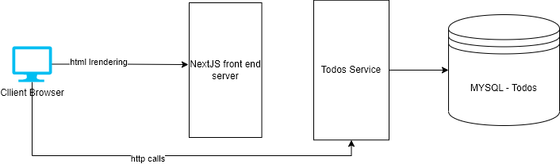

# TODO

A basic TODO app with a next.js + chakra front end, and a golang backend with Mysql as its data store. uses basic RESTful calls to save all
your todo item.

## Setup
### Requirements
- [Docker + Docker compose](https://docs.docker.com/compose/)

#### For Development
- npm and nodejs for chakra/react
- golang (1.12 absolute minimum)

With docker running, it's pretty straight forward to get started.
1. Run `docker-compose up` in this directory
2. See the [Readme](services/todo/README.md) for how to get the databse migrations1 and seeding done.
3. After migrations have completed, you may or may not need to restart docker-compose. 
4. head on over to http://localhost:3000. It should direct you to the UI with some pre-filled items.

## Overview
The app itself is divided into three horizontal layers, with potential for more slices in the services side in future features (i.e: Users).

The nextJS server runs as a node app inside a docker container, and serves its http to the client.

The client then makes client side requests to the todos service, which in turn interacts with the DB to fetch the desired data.

For more details on the todos service, [see its readme](services/todo/README.md). For the UI, see the [UI readme](ui/README.md)

## Tracing
A basic tracing configuration is set up with a Jaeger backend. It covers the basics of time spent tracing, etc. However it is not taking
advantage of any additional metrics that could be tracked, and is not tracking anything in the frontend (nextjs server would be a prime candidate for a phase two).
Additionally, I haven't included any unit tests at this time.

to see the tracer in action head to http://localhost:16686/ when docker compose is running (and assuming you've made a few requests in the UI, or with postman)

## Improvements and Caveats

### Tests
Testing is reasonably solid on the todos service. However, I admit that I'm pretty new with react, and nextjs. I didn't manage to get any testing done. The UI, thankfully, is reasonably simple and can be manually tested quickly enough. In production it'd be better to have automated testing before deploying. Also, the tracing code in the todo service could be testable as well.

## Refactoring Tracing
The tracing code in the todo service was created as a last minute addition. In practice, a package like this could most definitely be refactored out into its own generic package, that would then be
usable as a library across any additional services that are written in golang. 

### Service Startup
as mentioned earlier, using docker compose works well enough for a demo. However I'd rather see a small kubernetes cluster running our services. With it, I could have hidden everything behind an ingress controller (potentially saving CORS issues), and possibly included a users service that could authenticate. This is something I may look at later to demonstrate a more service based architecture that can scale out. 

Additionally, the migrations and seed data require some manual steps. The migrations are already dockerized and easy to run. They could be included in an initContainer of the todo service, where the container would check its migration status on startup, and act accordingly. This would keep migration related code out of the main application, and allow hand tuning should the need ever arise (i.e: an emergency reversion needed to be run by an ops person)

### Using NextJs's backend instead of client side requests
NextJs comes with its own server (can be deployed serverless even). Instead of running API calls from the client to the todo service, I'd rather proxy them through the Next server. This saves us some problems with cookies, CORS, private tokens, etc.

### Footnotes
1. I didn't have enough time to get a flawless migration running, but this could be accomplished with init containers in k8s, or with other services in Docker-Compose.